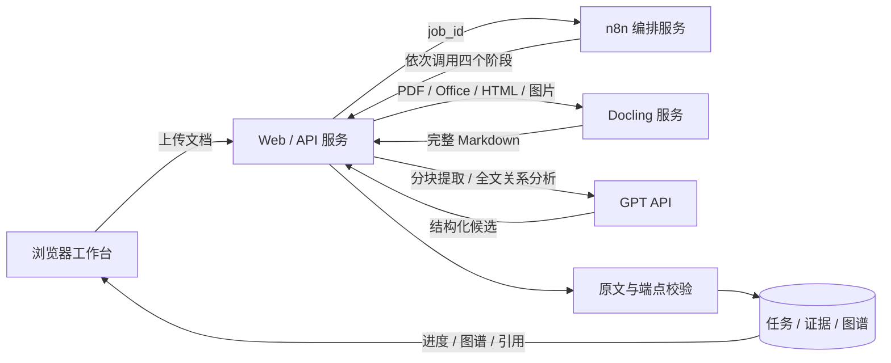

# 设计说明

## 架构

API 同源托管 UI，无需前端 CDN 或构建服务。服务保留原始文件、转换文本、章节块、提取候选的有效结果、被拒收的原因以及最终图谱。SQLite 保存任务元数据，文件保存较大结果。命名卷是持久化边界。

## 数据流与阶段

| 阶段 | 输入 | 处理 | 持久化输出 |
| --- | --- | --- | --- |
| 上传 | multipart 文档 | 后缀、大小和访问密钥检查 | 原文件、任务记录 |
| parse | 任务 ID | Docling / UTF-8 读取，规范换行，完整文本预算，章节与块划分 | document.md、parsed.json |
| extract | 每个知识块 + 完整文档 | 候选提取与证据校验；全文重要性筛选；同名同义合并；保留重要性理由 | candidates.json、concepts.json |
| relate | 全文 + 重要概念 + 一批源概念 | 核心直接关系；原文校验；去重及关系预算；再用全文复核语义方向、重要性和冗余，限制只能选择候选 ID | relation-candidates.json、relations.json |
| render | 有效概念与关系 | 汇总图谱、孤立概念和拒收报告 | graph.json |
| review | 关系 ID + 状态 | 确认、否决或重置 | 更新 graph.json |

知识部分对应文档内容结构，不是预定义的学科分类。文档中没有的概念不作为补全节点。原始字符位置属于规范换行后的 Markdown，浏览器使用 Unicode code point 切片保持 emoji 与中文偏移一致。

引用定位先做字面匹配，失败时仅忽略空白重新查找，并通过字符位置映射恢复原文真实切片。不得接受非空白字符替换、标点变化或拼造句子，提取阶段的搜索始终限制在当前块。全文复核不能创造新概念或新关系，其主观判断仍需人工确认。关系预算针对规范化后的 source；对称边按 ID 排序后统一计数，并非节点总度数上限。

## 关系方向

| 类型 | source → target |
| --- | --- |
| part_of | 源属于目标 |
| prerequisite | 源是目标的前提 |
| explains | 源解释目标 |
| causes | 源导致目标 |
| applies_to | 源应用于目标 |
| depends_on | 源依赖目标 |
| contrasts | 对称的对比 |
| related | 对称关联，必须有原文语义支持 |

`contrasts` 与 `related` 不画单向箭头，反向重复会合并。其余关系保留方向；同一对概念可以存在多种有证据的关系。

## UI 结构

- 顶部：当前位置、服务配置、示例切换、新建分析。
- 左侧：当前文档、历史任务、知识部分筛选。
- 概览：知识点数、未被否决的关系数、知识部分数。
- 图谱：主干 / 全部 / 聚焦三种视图；分层排列与正交避让路径；补充关系虚线；关系名称按需显示；当前与总关系数；搜索、章节、类型和模型自评阈值筛选；平移、缩放与适配。
- 聚焦视图将所选概念与直接邻居重新排为两列，便于窄屏阅读；主干与全部视图共享服务端布局。选中补充关系时，可在主干视图临时显示该边，数量同步更新。
- 证据：概念定义与重要性理由 / 关系解释、章节、逐字引用、转换后行号、原文高亮定位、人工复核。
- 上传弹窗：文档选择与拖入、n8n 处理链路、配置状态、真实数据发送提示。
- 配置弹窗：服务访问密钥、服务连通状态、GPT / 兼容协议、Base URL、模型 ID、密钥保存。
- 导出弹窗：JSON、SVG、Mermaid、draw.io；展示示例和真实结果的区别。

页面在 950px 以下把证据放到图谱下方；660px 以下隐藏侧栏，但保留顶部上传与配置入口。示例不写入真实分析历史，也不能执行关系复核。

## API

业务请求使用 `X-API-Key`。`/health`、静态资源、`/api/config` 和人工示例公开；真实文档、任务和模型配置受服务访问密钥保护。默认不开放跨源 CORS。

| 路径 | 方法 | 用途 |
| --- | --- | --- |
| /api/jobs | POST | 上传文档并创建任务 |
| /api/jobs | GET | 最近 100 个任务 |
| /api/jobs/{id}/launch | POST | `{ "mode": "n8n" }` 启动服务工作流 |
| /api/jobs/{id}/retry | POST | 失败任务重试，保留已完成阶段和失败历史 |
| /api/jobs/{id}/reanalyze | POST | 完成任务创建新的分析记录，复制原文件和完整解析，随后通过 launch 进入 n8n |
| /api/jobs/{id} | GET | 阶段、进度、错误与计数 |
| /api/jobs/{id}/stages/{stage} | POST | n8n 调用 parse / extract / relate / render |
| /api/jobs/{id}/graph | GET | 完整图谱 JSON |
| /api/jobs/{id}/document | GET | 转换后的原文 |
| /api/jobs/{id}/relations/{relation} | PATCH | `{ "status": "accepted" }` / rejected / unreviewed |
| /api/jobs/{id}/export/{format} | GET | json / svg / mmd / drawio；view=backbone 或 all；JSON 始终完整 |
| /api/settings/model | GET / PUT | 脱敏读取 / 保存模型配置 |
| /api/services | GET | API、n8n、Docling 连通状态 |

开发测试可显式用 `mode: direct` 调用同一服务内的异步执行器；正式 UI 固定使用 n8n。两者共享阶段、证据约束和持久化逻辑。

## 故障与运行边界

- 单实例 API，最多两个阶段请求同时处理；每个任务有互斥锁，阶段完成后支持幂等返回。
- GPT 接口的 429、500、502、503、504 和网络故障最多尝试三次。重试可能导致厂商重复计算，不能保证跨网络的计费 exactly-once。
- 模型输出未完成、拒答、JSON 不合法、文档超预算、部分 Docling 解析均明确失败。
- GPT 官方请求使用 `store: false`；不表示厂商的全部数据保留政策由此决定。
- 模型输出不是可信 HTML 或 XML，UI 使用文本节点，SVG / draw.io 使用转义或 XML 构建，Mermaid 标签编码为数字实体。
- 文件引用不接受任意服务器路径或远程文档 URL；只有成功创建的任务 ID 可访问任务数据。
- 失败任务可跳过已经完成的阶段重新执行；关系批次遇到输出上限自动二分缩小，但始终保留完整上下文。
- 当前没有多用户权限、自动删除策略、超长文档摘要模式、任务取消、阶段内部断点恢复或语义自动证明。
- n8n 工作流存在性、凭据绑定和发布状态需要首次部署配置。连通检查只说明进程可达，不证明工作流已经发布。

## 代码索引

`api.py`：HTTP 契约及认证。`pipeline.py`：四阶段编排。`llm.py`：Responses / Chat 适配与完整上下文预算。`grounding.py`：分块和来源约束。`selection.py`：重要性筛选结果校验及关系预算。`layout.py`：按复核状态、具体类型及置信度建立最大优先级生成森林，分层排列，额外边使用带拐弯和路径复用代价的 Manhattan A* 避让；缓存以节点及关系内容为键，复核后自动重算。`store.py`：任务持久化。`exports.py`：与工作台共享布局的图形导出。`static/`：浏览器工作台。`scripts/build_assets.py`：可重现的人工示例和 n8n 工作流生成器。
