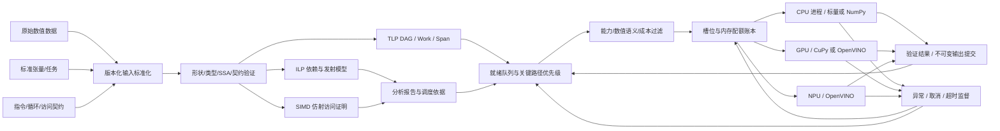

# PLDA v0.1 设计

## 1. 系统位置

`TheStructure.drawio` 中，PLDA 在“通信基础设施 / 负载均衡模块”内。节点 `8rw-NWJHrkYK3E8QMIOX-83` 接收路由区域的三个输入：原始数据、结构化标准数据、结构化标准分析数据；输出连接 DEVICE_1 的 CORE_1/2/3/X。2026-09-15 已在总图加入 PLDA 子模块概览和结果回传，并按来源校正路由区对调的标准数据/分析数据标签。同一文件第 2 页“PLDA 架构与数据流”给出可编辑的完整详图。



ILP/SIMD 与 TLP 分属不同层次：指令/循环描述可由上游编译器提供；实际任务 DAG 由张量输入输出构造。分析报告不自动把任意指令序列变成跨设备内核；可执行内核的 lowering 由适配器明确实现。

## 2. 判定目标与前提

目标是对一个**给定执行变换和观察契约**证明安全。不能承诺对所有程序、所有输入都完成精确判定。

形式上，对允许初态 `s` 和执行方案 `P`：

`Observations(P, s) ⊆ AllowedObservations(reference, s)`

观察包括规定的结果、返回值、错误与副作用顺序；终止/进展约束也须保留。实现中的作业取消和超时属于显式运行策略，其结果是失败状态，不伪装成原程序成功。

核心不变量：

1. SAFE 只在完整、正确的 IR 和声明的数值/控制/内存模型下成立。
2. 无法证明时保留顺序或输出 UNKNOWN；UNKNOWN 不等于不可并行。
3. UNSAFE 只否定当前普通并行/向量扩展方案，不能否定所有算法改写。
4. 可执行任务只有纯张量内核；共享输出采用单赋值。外部资源契约可增加顺序约束，不能授权副作用执行。
5. 资源未回收、结果未验证或前驱未成功时，不向后继暴露数据。

操作契约中的资源名必须是**规范分配标识**，不是可能别名的变量名。不能证明两指针不同，必须使用未知资源 `None` 或同一规范资源；起止地址采用分配内字节偏移。资源区间有效、循环访问在界内由前端保证，本版不是内存安全验证器。

## 3. 统一依赖分析

对原始顺序中 `i < j`，检查：

```
W_i ∩ R_j 非空 => RAW
R_i ∩ W_j 非空 => WAR
W_i ∩ W_j 非空 => WAW
effects 不完整 => 保留 i -> j，并记录未知
任一节点是 barrier => 保留 i -> j
显式控制/业务依赖 => 加入指定方向的边
```

相同资源的两个已知半开区间仅在相交时有冲突。未知资源的相对偏移没有可比性，不能用不相交的数字区间消除冲突。读/读可以并行。最后拓扑排序；包括隐式资源边在内形成环时拒绝输入，而不是删除边“修复”。

当前实现不自动移除 WAR/WAW。前端若进行 SSA/寄存器重命名，必须在 IR 中提供已验证的新版本及必要的输出提交顺序。标志寄存器、隐式操作数、volatile、锁、异常和控制流都必须在契约内表达。

## 4. ILP

输入是基本块内的抽象指令，不是源代码文本或未知 ISA 二进制。每条指令含 `latency`（结果就绪延迟）、`unit`（资源类别）、`occupancy`（占用一个单元的周期数）。机器含 `issue_width` 和每类单元数量。

列表调度在每个发射周期选择前驱均已完成的指令，且满足：

- 当周期发射数小于 `issue_width`；
- 对应单元有空闲实例；
- 指令访问和控制约束已经满足。

发射后，结果完成时间为 `issue + latency`，单元下次可用时间为 `issue + occupancy`。二者分开可表达流水化执行单元；无进展时直接跳到下一事件周期。

报告含依赖图、同周期组、分配端口、完成时间、估计周期与 IPC。该模型不包括 ROB、寄存器堆容量、缓存未命中、分支预测或真实 ISA 调度模型，因此结果不是实测硬件性能。需要目标 CPU 精度时可由后续 LLVM frontend 使用 llvm-mca 模型替换成本层。

## 5. TLP

可执行任务的 `inputs` 引用不可变张量，任务 ID 是唯一输出 ID。前驱输出作为后继输入时自动加入数据边；附加访问/控制/屏障边与之合并。

```
finish(v) = cost(v) + max(finish(u), u in predecessors(v))
Work = sum(cost(v))
Span = max(finish(v))
理论并行度上界 = Work / Span
```

Work/Span 使用同一 CPU 成本标尺，忽略调度/传输，因此是理想化指标。不能将它直接理解为异构设备加速倍数。拓扑层宽度只是该分层策略的同时就绪数量，不称为最大反链或最优并发度。

就绪节点优先级采用反向关键路径长度：`rank(v)=min_compute_cost(v)+max(rank(successor))`。默认成本仅是占位估计；允许调用者提供实测标定值。

## 6. SIMD

本版分析普通独立迭代的向量扩展。每个访问为：

`[stride * i + offset, stride * i + offset + width)`，`0 <= i < trip_count`。

访问按循环体语句顺序列出；转换必须保持同一 lane 内语句顺序。涉及未知副作用、未知控制、未解析别名、非仿射寻址或未知循环次数时，返回 UNKNOWN。掩码分支需要显式的目标支持和完整语义契约。

先使用等步长代数检查。两个字节访问碰撞要求：

`stride * (i-j) = offset_b + byte_b - offset_a - byte_a`。

若存在整数解且 `0 < abs(i-j) < trip_count`，并且至少一个是写，则提供冲突反例。步长为 0 单独处理。此检查的耗时不随 trip_count 增长，因此可证明百万次逐元素循环。

步长不同则使用有限足迹精确检查：记录每个资源/字节首次读写的迭代与语句，发现跨迭代写冲突即停止。检查前限制总代价 `trip_count * sum(access.width)`，超预算返回 UNKNOWN。不会在超时后将剩余部分假定无冲突。

归约由独立的最终归约元数据表达，不能据此删除一般内存递推依赖。支持 `sum/product` 的模 2^64 无符号代数或显式允许重结合的浮点代数；严格浮点重结合方案判为 UNSAFE。这里没有实现 prefix-scan、波前并行、SLP 打包、多面体变换或有序向量归约。

输出 `vector_iterations=n//width` 与 `scalar_tail=n%width`；不把能向量化等同于有收益。SIMD ISA 宽度是调用者输入，不是未经探测的本机 AVX 保证。

## 7. 异构分配

候选设备须通过：任务许可的设备种类、数值语义、适配器算子/形状/dtype 支持、健康状态、任务尝试历史以及逻辑内存预算。

```
reservation = 2 * (distinct_input_bytes + output_bytes) + workspace_bytes
cost_ms = launch_ms + compute_ms + 1000 * transfer_bytes / bandwidth
score = estimated_queue_delay + cost_ms
```

只分配实际有空闲槽位和内存额度的设备。如果估计等待繁忙设备更划算，则等待并在每次完成后重估。此为启发式，不保证全局最优、低能耗或最短时间。

CPU 工作进程使用一个原生库线程的环境设置减少嵌套超额并行；具体厂商 runtime 的内部线程数仍需部署配置。CPU 核由 OS 分配，不绑定指定 CORE 编号。GPU/NPU 的内部 EU/SM/tile 由厂商 runtime 控制；`Device.slots` 是并发任务配额，不能解释成物理核心数量。

## 8. 数据与提交

默认数据路径是 `host -> worker -> device -> host -> commit`。CPU 通过进程参数获得不可变 bytes；CUDA 使用 `asarray` 暂存并在 `asnumpy` 与同步后返回；OpenVINO 使用显式目标的同步推理。每个任务输出到自己唯一的临时目录，先写数据再原子发布状态文件。

监督器确认进程退出、检查状态、字节数及既定输出规格后，才把结果加入作业存储。失败和取消的部分文件不会被引用。主机存储保留当前作业的所有输入与成功输出，准入时按全部静态形状总和检查；不伪称已经实现引用计数回收或零拷贝。

`shard_elementwise` 对一维同形输入按连续范围分片，每片产生独立任务，最后由 CPU 按原顺序 concat。支持不足整片的尾部和空向量。它不会任意切分依赖循环、跨片归约、矩阵乘法或神经网络图。更复杂的数据分布要新增有正确性契约的分区/合并算子。

## 9. 异常状态机

```
PENDING -> RUNNING -> SUCCEEDED
                  -> PENDING    (有限次数，换可用设备)
                  -> FAILED
PENDING -> SKIPPED                (前驱失败)
PENDING / RUNNING -> CANCELLED
```

| 事件 | 行为 |
| --- | --- |
| 非法请求、重复输出、环、shape 不一致 | submit 前拒绝；不启动工作 |
| 作业队满 | 同步拒绝；上游可稍后重试 |
| 单任务永久无候选/超预算 | FAILED；后继 SKIPPED |
| 设备暂时忙 | 保持 PENDING，等待释放 |
| OOM / 可重试内核错误 | 已停止后释放；该任务排除失败设备；有剩余次数才尝试别的候选 |
| 加速器不可用、超时、进程崩溃 | 隔离该设备至模块实例关闭；纯任务可换设备 |
| CPU 任务超时/崩溃 | 杀掉独立进程，不隔离整个 CPU；该任务排除失败设备 |
| 输入/内核参数或结果无效 | 不自动重试 |
| 任务超时 | 终止并确认退出，丢弃结果；不提前释放占用 |
| 作业取消/超时 | 停止全部活动进程，取消未完成任务，保留已提交输出供诊断 |
| 监督器内部异常 | 清理活动进程；结构化 SUPERVISOR_ERROR；隔离整个设备清单 |

重试次数是额外尝试上限，不保证用满；没有可用替代设备即失败。任务设备许可为 `(GPU,)` 时不会越权改到 CPU。任务结果在数值模式约束内才能回退。模块没有硬件抢占、机器级恢复或 exactly-once 外部 IO 承诺。

## 10. 复杂度与边界

- 通用依赖构图：最坏 `O(N² A²)`，A 为单操作访问数量。拓扑分层为当前简单列表实现，最坏 `O(N²+E)`。
- SIMD 等步长检查：访问对的字节宽度乘积；有显式预算。通用精确检查：`O(trip_count * sum(width))` 时间/空间上界。
- 调度：就绪列表排序与 `tasks * devices` 的成本扫描；不求 NP-hard 的最优排程。
- ILP 使用事件推进；排序启发式不保证最优；不生成机器码。
- 分析依赖用户/编译器的契约正确性，不自动证明未知业务不变量。
- 运行时是单主机、单进程监督、有界多工作进程，不是分布式通信协议实现。
- 每次任务都创建进程和设备上下文，因此当前优先保证功能与隔离。后续可加入常驻 worker、设备驻留缓存和批处理；须保留超时隔离、生命周期与资源账本的不变量。

## 11. 一手依据

- [LLVM Auto-Vectorization](https://llvm.org/docs/Vectorizers.html)：依赖、别名检查、归约及尾部处理。
- [LLVM llvm-mca](https://llvm.org/docs/CommandGuide/llvm-mca.html)：基于目标机器模型估计指令吞吐与资源压力。
- [CuPy 数据与设备接口](https://docs.cupy.dev/en/stable/user_guide/basic.html)：设备上下文、主机/设备拷贝、流。
- [OpenVINO Core](https://docs.openvino.ai/2026/api/ie_python_api/_autosummary/openvino.Core.html)：设备发现、显式设备编译与推理。

这些资料支持设计所用的原则与接口；本实现的安全性边界、调度策略和测试结果由代码与验证记录单独说明。
