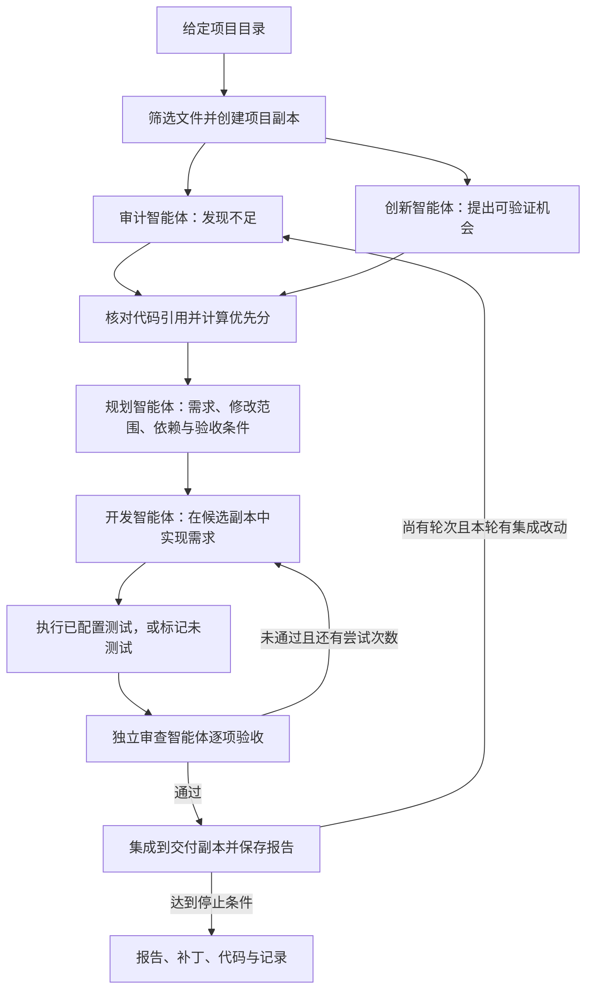

# Self Renew

一个本地运行的多智能体研发程序：输入代码项目目录，智能体自行发现不足与创新机会，形成带验收条件的需求，再调度开发与审查智能体完成改动。无需预先指定改进方向。

程序默认通过本机安装的标准 Codex CLI 调用模型。每个角色由独立的 `codex exec` 会话执行；Python 编排器继续负责隔离副本、需求范围、测试、静态审查和补丁交付。也可显式切换到兼容的 Responses API。

## 快速开始

需要 Python 3.11 或更高版本。运行时仅使用 Python 标准库，无需安装第三方依赖。以下命令在本程序根目录执行。

先运行不需要 API Key 的离线演示：

```powershell
python -m renew demo
```

演示针对内置的小型 Python 项目，使用固定脚本模拟模型决策，真实执行项目复制、文件修改和测试。它用于验证完整工作流程，不代表真实模型的发现或开发能力。

真实运行前，确认标准 Codex CLI 已安装并登录：

```powershell
codex --version
codex login status
python -m renew run "D:\projects\your-project"
```

不传连接配置时，Codex CLI 使用自己的登录和服务配置。也可为本次运行指定 endpoint 和 API Key，详见下方“切换 endpoint 和 Key”。默认所有角色使用 `gpt-5.6-terra`，可按所用服务支持的模型分别修改四个角色字段。

这条命令会完成分析、需求规划、开发与独立静态审查，并输出改动副本。默认不执行目标项目的代码；未运行测试的交付会明确标记为“已实现，待运行测试”。

## 常用命令

```powershell
# 只分析项目并生成需求
python -m renew run "D:\projects\your-project" --analyze-only

# 使用自定义配置（样例已指定 API 地址，需先设置 OPENAI_API_KEY）
python -m renew run "D:\projects\your-project" --config renew.example.json

# 执行配置中明确列出的测试命令
python -m renew run "D:\projects\your-project" --config renew.example.json --run-tests

# 为所有角色指定模型
python -m renew run "D:\projects\your-project" --model gpt-5.6-terra

# 指定一个尚不存在、且位于目标项目之外的输出目录
python -m renew run "D:\projects\your-project" --output "D:\renew-results\first-run"

# 离线演示也可指定新的输出目录
python -m renew demo --output "D:\renew-results\demo-run"

# 查看完整参数
python -m renew --help
python -m renew run --help
```

支持本地目录中的不同语言与框架项目；测试方式由项目自身决定。远程仓库请先 `git clone` 到本地，再传入目录。程序不会自动安装依赖，也不能保证任意项目都可直接运行测试。

## 工作流程



每轮的审计与创新分析并行进行。每个开发需求使用独立上下文，按依赖顺序串行实施；后续需求可以读取已经集成的前置改动。

发现必须包含真实文件路径、行号与原文引用。程序先核对引用，再按影响、置信度、工作量与风险排序。创新项必须说明待验证假设和预期价值；引用通过仅证明它与现有代码相关，不等于缺陷已经复现或市场需求已经得到验证。

规划结果限定每项需求可修改的具体文件。开发智能体可以读取、搜索与写入这些文件，审查智能体只读。每次审查还要验证此前已经交付的验收条件，避免新需求撤销原有成果。未通过验收的候选改动不会作为已接受需求集成；记录会保留，依赖它的后续需求会被阻止。

`max_cycles` 控制自动迭代轮次。没有新的有效发现、本轮没有集成改动、测试失败或达到执行限制时，流程会停止；它不会无限自我修改。

## 配置与测试

复制并修改 `renew.example.json`。`renew.example.json` 和 `renew.validation.config.json` 均已显式指定官方 `base_url`，使用它们时需要 API Key；推荐保持 `api_key: null`，将 Key 放入 `api_key_env` 指定的环境变量。以下配置使用 Python 标准库的 `unittest`：

```json
{
  "provider": "codex_cli",
  "codex_command": "codex",
  "base_url": "https://api.openai.com/v1",
  "api_key_env": "OPENAI_API_KEY",
  "api_key": null,
  "analyst_model": "gpt-5.6-terra",
  "planner_model": "gpt-5.6-luna",
  "developer_model": "gpt-5.6-sol",
  "reviewer_model": "gpt-5.6-terra",
  "max_requirements": 2,
  "max_cycles": 2,
  "max_attempts": 2,
  "max_turns": 16,
  "max_api_calls": 100,
  "max_total_tokens": 300000,
  "test_commands": [
    ["python", "-m", "unittest", "discover", "-s", "tests", "-v"]
  ],
  "exclude": ["private-data", "*.sqlite"]
}
```

`analyst_model` 同时用于审计和创新两个角色；其余三个模型字段分别控制规划、开发和审查。模型名须由所选服务及账户支持。

| 字段 | 默认值 | 含义 |
| --- | --- | --- |
| `provider` | `codex_cli` | `codex_cli` 使用标准客户端；`openai_api` 使用兼容 Responses API |
| `codex_command` | `codex` | 标准 Codex CLI 可执行文件名或路径 |
| `max_requirements` | `2` | 每轮最多实施的需求数 |
| `max_cycles` | `1` | 最多自动迭代轮数 |
| `max_attempts` | `2` | 每个需求最多开发与验收的次数 |
| `max_turns` | `16` | 每次智能体调用的模型交互轮数上限 |
| `max_output_tokens` | `8000` | 单次模型响应的输出 token 上限 |
| `max_api_calls` | `100` | 整次运行的 Codex CLI 会话或 API 请求上限 |
| `max_total_tokens` | `300000` | 根据已返回用量检查的累计 token 停止阈值 |
| `request_timeout` | `600` | 单次 Codex CLI 会话或 API 请求超时秒数 |
| `test_timeout` | `120` | 每条测试命令超时秒数 |
| `test_commands` | `[]` | 明确配置的测试命令列表 |
| `exclude` | `[]` | 额外排除的相对路径、文件名或通配模式 |
| `base_url` | `null` | 两种 provider 均可设置的 HTTPS API 基础地址，不带 `/responses`；留空时的行为见下文 |
| `api_key_env` | `OPENAI_API_KEY` | 保存本次 API Key 的环境变量名 |
| `api_key` | `null` | 可选明文 API Key；优先于配置中的环境变量，推荐保持 `null` |

调用次数和 token 限制用于约束执行量，不是美元费用上限。Codex CLI 模式从客户端 JSON 事件记录用量；若客户端版本未返回 usage，则 token 显示为 0。单次调用或已并行发出的调用仍可能使实际累计量超过阈值。

Codex CLI 失败时，报告会保留截断、脱敏后的标准错误，便于识别登录、模型和连接问题。兼容 API 模式会保留服务端 JSON 中的错误消息、代码、类型和请求 ID；HTML和其他响应字段不会写入报告。

测试命令采用参数数组，每个元素是一个参数，不使用 `&&`、管道等 shell 语法。例如 Windows 的 Node.js 项目可配置：

```json
{
  "test_commands": [["npm.cmd", "test", "--", "--runInBand"]]
}
```

该示例适用于支持 `--runInBand` 的测试脚本；请按项目实际测试框架调整。其他平台通常将 `npm.cmd` 改为 `npm`。

测试在额外创建的临时项目副本根目录运行，只有传入 `--run-tests` 才启用。临时副本中的新产物不会混入交付；若测试改写输入项目文件，验证会失败。没有配置测试命令时，即便指定 `--run-tests` 也只能标记为待验证。请先准备好目标项目的解释器、依赖及测试环境；可在参数数组首项指定外部虚拟环境中 Python 的绝对路径。`node_modules` 和虚拟环境默认不复制，若项目依赖副本内的安装目录，应先安排合适的测试环境。

测试命令会在本地主机执行代码，包括智能体产生的代码；项目副本并不是操作系统沙箱。只对可信项目启用，或把整个程序放在你自行配置的容器等隔离环境中运行。测试命令也可能自行访问网络或写入副本之外的路径。

## 切换 endpoint 和 Key

`--provider` 选择调用方式：`codex_cli` 通过标准 Codex CLI，`openai_api` 由本程序直接调用兼容的 Responses API。两者都支持 `--endpoint`（别名 `--base-url`）、`--api-key-env` 和 `--api-key`，命令行参数覆盖 JSON 配置。

推荐为不同服务分别设置环境变量，每次一起选择 endpoint 和对应的 Key。将下面占位地址、Key 和模型名换成你的服务支持的值：

```powershell
$env:SERVICE_A_API_KEY = "替换为服务 A 的 API Key"
$env:SERVICE_B_API_KEY = "替换为服务 B 的 API Key"

# 本次通过 Codex CLI 使用服务 A
python -m renew run "D:\projects\your-project" --provider codex_cli --endpoint "https://api.service-a.example/v1" --api-key-env SERVICE_A_API_KEY --model "服务 A 支持的模型"

# 下一次切换至服务 B
python -m renew run "D:\projects\your-project" --provider codex_cli --endpoint "https://api.service-b.example/v1" --api-key-env SERVICE_B_API_KEY --model "服务 B 支持的模型"

# 同一组服务 B 连接也可切换为直接调用 Responses API
python -m renew run "D:\projects\your-project" --provider openai_api --endpoint "https://api.service-b.example/v1" --api-key-env SERVICE_B_API_KEY --model "服务 B 支持的模型"
```

也可以复制为 `renew.service-a.json`、`renew.service-b.json`，分别填写 `base_url`、`api_key_env` 和模型字段，每次通过 `--config` 选择。`api_key_env` 填环境变量名，实际 Key 在运行命令的终端环境中设置。

Key 的选择规则：

- `--api-key KEY` 和 `--api-key-env NAME` 互斥。
- `--api-key KEY` 使用命令行给出的 Key；该写法可能留在命令历史或进程参数中，推荐使用 `--api-key-env`。
- `--api-key-env NAME` 会忽略 JSON 中的明文 `api_key`，只读取指定变量；变量缺失或为空时直接报错，不回退到其他 Key。任何显式 `--api-key-env` 都选择 API Key 认证，包括 `--api-key-env OPENAI_API_KEY`。
- 未提供这两个命令行参数时，先使用 JSON 的 `api_key`，没有明文 Key 才读取 `api_key_env` 指定的变量。

`codex_cli` 在配置中的 `base_url`、`api_key` 都为 `null`、`api_key_env` 为默认值 `OPENAI_API_KEY`，且未传连接命令行参数时，保留本机 Codex 登录和服务配置。不传 `--config` 及连接参数即采用这个默认行为；若想用配置文件继续现有登录，将连接字段设为：

```json
{
  "provider": "codex_cli",
  "base_url": null,
  "api_key_env": "OPENAI_API_KEY",
  "api_key": null
}
```

在 JSON 中设置 `base_url`、`api_key` 或非默认 `api_key_env`，或使用 `--endpoint`、`--api-key`、`--api-key-env` 后，`codex_cli` 为本次运行使用自定义 API 连接，必须提供 Key；未指定 `base_url` 时使用 `https://api.openai.com/v1`。`openai_api` 总是需要 Key，未指定 `base_url` 时也使用该官方地址。只设置环境中的 `OPENAI_API_KEY` 不会让默认 `codex_cli` 自动改用 API 连接。

本次 Codex 连接通过 [官方自定义模型提供商配置](https://learn.chatgpt.com/docs/config-file/config-advanced#custom-model-providers) 传入；程序不会修改本机 Codex 配置文件，Key 仅通过子进程环境传递，不加入 Codex 命令行参数。保存的配置和报告会对 Key 脱敏。如果本次 `--config` 文件位于目标项目内，程序会自动将它排除出项目快照；其他含敏感信息的文件仍需通过 `exclude` 排除。

## 如何查看交付

默认输出位于目标项目旁的 `.renew-runs` 下，每次使用新的运行目录。程序也接受 `--output` 指定的新目录，已有目录会被拒绝。原项目不会被自动覆盖。

```text
一次运行目录/
├── report.md                 中文发现、需求、交付状态与用量报告
├── run.json                  结构化运行状态
├── events.jsonl              智能体工具调用事件
├── snapshot.json             快照文件列表及排除记录
├── baseline-tests.json       初始测试结果
├── changes.patch             已集成改动的文本差异
├── source/                   初始项目快照
├── workspace/                集成后的交付副本
└── cycle-1/
    ├── analysis.json         两个分析角色的输出
    ├── requirements.json     需求与验收条件
    ├── integration-tests.json
    └── R1/
        ├── candidate/        该需求的候选代码
        ├── attempt-1.json    开发总结、测试结果和审查结论
        ├── attempt-1.patch   本次尝试的差异
        └── delivery.json     需求交付状态
```

文件会随运行阶段产生；分析模式、失败或中断时可能没有后续产物。先查看 `report.md`，再检查 `changes.patch` 和 `workspace/` 中的改动，确认后自行合并回项目。

| 状态 | 含义 |
| --- | --- |
| `analyzed` | 只分析模式已生成发现与需求 |
| `verified` | 已配置测试通过，且独立审查逐项通过 |
| `implemented_unverified` | 已实现并通过静态审查，尚无运行测试的通过证据 |
| `no_changes` | 没有产生可交付改动 |
| `needs_attention` | 有需求未通过验收或依赖未满足 |
| `integration_failed` | 集成后测试未通过，需要检查交付副本 |
| `failed` / `interrupted` | 运行失败或中断，查看已保存记录 |

测试通过代表配置的检查成功，并不保证发现所有问题。当前不支持从失败位置恢复；修正配置、网络或代码环境后启动新的运行即可。

## 项目读取范围

- Git 仓库根目录会依据 Git 的文件列表读取已跟踪文件和未被忽略的新文件；普通目录也可使用。
- 依赖目录、构建缓存、Git 元数据、符号链接及 Windows junction 默认排除。常见敏感文件名如 `.env`、私钥和凭据文件也会被过滤；`.env.example` 可以进入快照。
- 过滤依据路径和文件名，不是完整的敏感信息检测。API 模式会把智能体读取到的代码片段发送到配置的 API 服务；请用 `exclude` 排除不应发送的内容。
- 快照上限为 20,000 个文件、总计 250 MiB、单文件 25 MiB，超限会报错并要求缩小范围。文本读写工具的单文件上限为 1 MiB，读取内容采用 UTF-8；二进制资源在快照限制内保留，但不作为文本分析。
- 智能体有调用与上下文限制，分析属于有限范围的审查；报告会记录未覆盖的部分。当前开发工具支持创建和替换文本文件，不提供删除、重命名、任意 shell 命令、自动部署或自动合并。

## 验证本程序

```powershell
python -m unittest discover -s tests -v
python -m renew demo
```

离线测试与演示不调用 Codex。`codex_cli` 真实运行需要已安装的标准 Codex CLI，以及本机登录或显式配置的 API Key；`openai_api` 兼容模式需要可用的 API Key。两种真实调用方式都需要相应的网络环境。

默认实现通过 `codex exec --output-schema` 获取结构化结果；兼容模式采用 OpenAI 官方的 [Responses API 函数调用流程](https://developers.openai.com/api/docs/guides/function-calling)。
