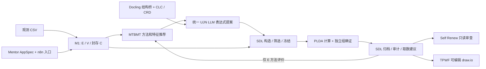

# OGv01：自动化推理研究与工程

本仓库整合文档知识、统计发现、元学习、并行计算与工作流项目。新增 `ogflow` 业务入口，实现观测数据 → MTBMT 推荐 → SDL 生成与筛选 → 冻结确证 → 归档，并接入文档知识、PLDA、Mentor 规格、Self Renew 只读审查和 TPWF 架构图生产。保留原目录及 SDL、Mentor、MTBMT 三个来源的 54 个原始 Git 提交。

项目主线与实际完成状态见 [自动化推理主线](docs/自动化推理主线.md)，全部目录见 [项目清单](docs/项目清单.md)，历史整合方法见 [Git 历史迁移](docs/GIT_HISTORY.md)。

[业务说明与运行](docs/BUSINESS_CLOSED_LOOP.md)、[本次业务验证](docs/BUSINESS_VERIFICATION.md) 说明实际接线和边界。[历史整合验证](docs/VERIFICATION.md) 保留初次迁移的记录；后续开发已修复 SDL 两项证据协议问题，并更新了两项过时的时间戳测试。



图中连接通过根目录 `ogflow` 的适配层实现。业务模型统一使用 `https://llm.ujn.edu.cn/v1` / `deepseek-v41-flash`；密钥仅在本机 `.env`。Wiki、Anki、早期 PRT 不参与该流程。

## 运行业务闭环

```powershell
.\tools\business\setup.ps1
.\.venv\Scripts\ogflow.exe run examples/business/demo-task.json
.\.venv\Scripts\ogflow.exe architecture --output artifacts/business/architecture
.\tools\business\start.ps1
```

示例是合成数据，仅用于实现验证。API 默认本机 8095 端口，需要 `OG_API_TOKEN`。参数、数据资格、失败重试与文档依赖见 [完整业务说明](docs/BUSINESS_CLOSED_LOOP.md)。架构产物位于 [artifacts/business](artifacts/business/)。

## 主要入口

| 项目 | 作用 | 入口 |
| --- | --- | --- |
| SDL | 数据证据协议与统计发现闭环，M1–M12 | [项目目录](F-20260919-StatisticalDiscoveryLearning/)、[模块契约](F-20260919-StatisticalDiscoveryLearning/INTERFACES.md) |
| MTBMT | 特征相关性量化、元学习算法选择、训练轨迹指导 | [README](MTBMT/README.md)、[整合说明](docs/MTBMT_INTEGRATION.md) |
| PLDA | 保守并行可行性分析、CPU/GPU/NPU 调度 | [README](F-20260914-Utils/ParallelLogicDeterminationAlgorithModule/README.md) |
| ConceptLayerConstructor | 文档 → 有原文依据的知识层级 | [README](F-20260914-Utils/ConceptLayerConstructor/README.md) |
| ConceptRelationDraw | 文档 → 概念、关系与可复核图谱 | [README](F-20260914-Utils/ConceptRelationDraw/README.md) |
| n8n-Docling | 解析、翻译、复核、Obsidian 输出 | [使用说明](F-20260914-Utils/n8n-Docling/使用说明.md) |
| ThePicWorkingFlow | 代码 / 文档 → 结构化架构 → 校验过的 draw.io | [README](F-20260914-Utils/ThePicWorkingFlow/README.md) |
| Self Renew | 多智能体发现需求、开发与独立审查 | [README](F-260908-GPTSelf-renew/README.md) |
| Mentor | Teacher 设计、Student 执行的文档工作流；部分实现 | [设计文档](F-20260914-Utils/Mentor/README.md)、[实际状态](docs/项目清单.md) |

## 验证与运行

推荐 Python 3.12。根目录 `python -m pytest -q` 只运行业务测试。原项目回归仍需逐项目执行，避免多个同名测试包互相覆盖。

```powershell
# 三个仅依赖标准库的核心项目，逐项目运行离线测试
py -3.12 tools/monorepo/check_projects.py --stdlib

# 检查迁移记录、文件散列、历史提交和敏感文件边界
py -3.12 tools/monorepo/import_workspace.py verify --repo . --revision 04e4cff
```

CLC、CRD、架构工作台的测试分别在其项目目录执行 `python -m pytest -q`。配置说明和启动命令见各自 README；`.env.example` 可提交，实际 `.env`、n8n 数据库和模型密钥仅在本机配置。

Wiki 使用参数化配置，详见 [迁移后的 Wiki 配置](docs/LOCAL_SETUP.md)。原有机器绝对路径在部分工具中仍需按新机器调整。许可证按各子项目及第三方内容分别适用，Mentor 和 MTBMT 的 `LICENSE` 保留在各自目录。
