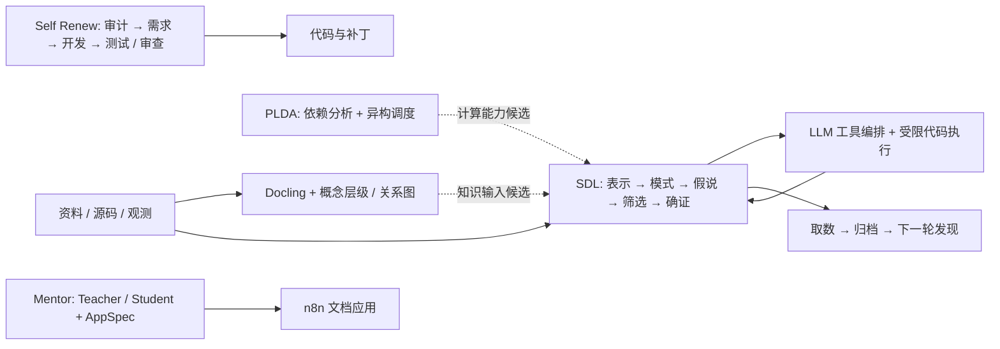

# OGv01：自动化推理研究与工程

本仓库整合文档与知识结构化、并行计算、统计发现、智能体研发和工作流应用构建项目。保留原项目目录名及已有 Git 提交，统一导航、历史来源与离线验证入口。

项目主线与实际完成状态见 [自动化推理主线](docs/自动化推理主线.md)，全部目录见 [项目清单](docs/项目清单.md)，历史整合方法见 [Git 历史迁移](docs/GIT_HISTORY.md)。



实线表示项目内部已有流程；虚线表示跨项目整合建议。当前统一的是代码仓库，各模块仍保留自己的接口、配置和运行环境。

## 主要入口

| 项目 | 作用 | 入口 |
| --- | --- | --- |
| SDL | 数据证据协议与统计发现闭环，M1–M12 | [项目目录](F-20260919-StatisticalDiscoveryLearning/)、[模块契约](F-20260919-StatisticalDiscoveryLearning/INTERFACES.md) |
| PLDA | 保守并行可行性分析、CPU/GPU/NPU 调度 | [README](F-20260914-Utils/ParallelLogicDeterminationAlgorithModule/README.md) |
| ConceptLayerConstructor | 文档 → 有原文依据的知识层级 | [README](F-20260914-Utils/ConceptLayerConstructor/README.md) |
| ConceptRelationDraw | 文档 → 概念、关系与可复核图谱 | [README](F-20260914-Utils/ConceptRelationDraw/README.md) |
| n8n-Docling | 解析、翻译、复核、Obsidian 输出 | [使用说明](F-20260914-Utils/n8n-Docling/使用说明.md) |
| ThePicWorkingFlow | 代码 / 文档 → 结构化架构 → 校验过的 draw.io | [README](F-20260914-Utils/ThePicWorkingFlow/README.md) |
| Self Renew | 多智能体发现需求、开发与独立审查 | [README](F-260908-GPTSelf-renew/README.md) |
| Mentor | Teacher 设计、Student 执行的文档工作流；部分实现 | [设计文档](F-20260914-Utils/Mentor/README.md)、[实际状态](docs/项目清单.md) |

## 验证与运行

推荐 Python 3.12。各项目单独安装自己的依赖，先在对应项目目录运行；不要从仓库根目录直接递归发现全部 `tests`，多个项目使用同名测试包。

```powershell
# 三个仅依赖标准库的核心项目，逐项目运行离线测试
py -3.12 tools/monorepo/check_projects.py --stdlib

# 检查迁移记录、文件散列、历史提交和敏感文件边界
py -3.12 tools/monorepo/import_workspace.py verify --repo .
```

CLC、CRD、架构工作台的测试分别在其项目目录执行 `python -m pytest -q`。配置说明和启动命令见各自 README；`.env.example` 可提交，实际 `.env`、n8n 数据库和模型密钥仅在本机配置。

Wiki 使用参数化配置，详见 [迁移后的 Wiki 配置](docs/LOCAL_SETUP.md)。原有机器绝对路径在部分工具中仍需按新机器调整。许可证按各子项目及第三方内容分别适用，Mentor 的 `LICENSE` 保留在其原目录。
