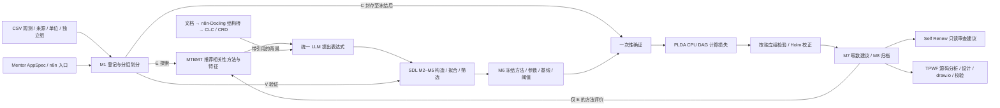

# OGv01 整体业务闭环

版本：0.2.0，2026-09-30。入口是仓库根目录的 `ogflow`，运行代码直接调用保留在原目录中的子项目。

## 1. 已实现的主流程



Wiki、Anki、早期 PRT、VM 练习没有接入该业务流程。

| 子项目 | 本次实际接线 | 接入边界 |
| --- | --- | --- |
| MTBMT | E 元特征、三种相关性评分、分组交叉验证、随机森林历史选择器、经验 JSONL | Pearson / Spearman / 互信息；轨迹指导、Guided CART/ASHA 未接入 |
| SDL | M1 证据管理、M2–M8 发现与确证、M10 表达式解析护栏 | 预测任务、一轮冻结族；M11/M12 通用智能体不是默认执行入口 |
| PLDA | Program / Task / Tensor 损失计算 DAG | 使用 CPU；未验收 GPU/NPU 加速 |
| n8n-Docling | 复用结构保护和章节切分；重建工作流使用统一模型 | 业务接口直接调用 Node 结构桥；不需要先启动 n8n |
| CLC / CRD | 同一份解析 Markdown 构造带依据的层级和关系图 | 文档只是探索背景，不计作确证样本 |
| Mentor | AppSpec 验证、任务 Schema、执行阶段、OGflow n8n 工作流 | 新增 OGflow 编译目标；原发票应用的缺失 API/CLI 未冒充完成 |
| Self Renew | 原 AgentRunner、RepoTools、findings 引用校验；新增 Chat Completions 传输 | 对业务代码做有预算的只读审查，输出待审查建议，不自动改代码 |
| TPWF | 原分析、设计、渲染、质量门禁、发布阶段 | 生成原生可编辑 draw.io；源码引用与布局校验不等于语义完全正确 |

## 2. 观测契约和统计规则

任务文件示例：`examples/business/demo-task.json`。这是合成数据演示。`demo-with-knowledge-task.json` 另包含文档知识输入。

CSV 必须含声明的特征、目标、分组字段。`record_id`、`event_time`、`environment` 可选。任务须声明单位、独立性假设、最小效应阈值和 alpha。缺值、非有限值、重复 ID、缺列、空分组会被拒绝。当前限制为 20 MiB、20,000 行、至少 30 个组、最多 8 个特征。

M1 按组划分 E/V/C1 为 60%/20%/20%，同组读数不跨区。E 用于推荐、构造表达式与拟合斜率/截距；V 只检查固定参数的预测误差是否优于 E 均值常数基线。LLM 接收 E 摘要与少量 E 样例，不能读取封存 C 行。模型表达式经 SDL AST 解析，拒绝目标变量、未选特征和任意代码。

冻结计划在绑定和消费 C 前落盘，包含表达式、E 拟合参数、常数基线、阈值、变量、统计方法和策略摘要。每个候选单独计算每组的平均平方误差改善，统计单位是独立组，各组权重相同。对超过阈值的组数执行单侧精确二项尾概率检验，原假设概率不超过 0.5；等于阈值按失败计数。效应描述为组改善的中位数。SDL 负责 alpha 支出、族内 Holm 校正、结果分类与归档。

独立性是任务所有者声明，软件不会证明它。少于冻结的最低组数，或表达式在 C 上无定义时，报告不可用检验，不授予支持等级。默认最低组数 10；只有 30 个组的输入，20% C 可能不足以确证。预测改善不能直接解释为因果发现。合成示例的通过只验证实现链条。

经验库只保存 E 方法评价，排除当前 dataset_id 和相同来源散列。至少三个不同历史数据集时训练实际 MTBMT 随机森林，按数据集聚合记录；此前使用实测分组 CV 冷启动。历史标签与当前评价均为 `negative_mse + 0.1 × stability`，耗时记录但不参与标签。此处尚未证明元学习推荐优于冷启动。

## 3. 安装和统一模型配置

从完整仓库运行，推荐 Python 3.12 和 Node.js。根包通过源码适配器引用子项目，需保留其目录；它不是脱离仓库的独立 wheel。

```powershell
cd C:\Users\Lenovo\Desktop\OGv01\OGv01-monorepo
.\tools\business\setup.ps1
# 如需 PDF / DOCX 的 Docling 解析：
# .\tools\business\setup.ps1 -Documents
```

本机 `.env` 使用 `OG_LLM_BASE_URL=https://llm.ujn.edu.cn/v1`、`OG_LLM_MODEL=deepseek-v41-flash`。密钥配置于 `OG_LLM_API_KEY`，API 访问令牌配置于 `OG_API_TOKEN`，不会写入 Git。已按用户提供的配置在本机设置；新克隆需要自行配置。业务 LLM 调用统一走 `/chat/completions`，通过兼容传输支持 Self Renew 工具调用。超时默认 180 秒，输出与轮数有预算；调用失败不会用模拟结果替代。

```powershell
.\.venv\Scripts\ogflow.exe check-llm
.\.venv\Scripts\ogflow.exe run examples/business/demo-task.json
.\.venv\Scripts\ogflow.exe run examples/business/demo-with-knowledge-task.json
# 离线实现验证（不调用模型）：
.\.venv\Scripts\ogflow.exe run examples/business/demo-task.json --offline
# 独立生成当前业务架构：
.\.venv\Scripts\ogflow.exe architecture --output artifacts/business/architecture
.\.venv\Scripts\ogflow.exe application
```

CLI 的输入路径相对任务 JSON 所在目录。API 的输入路径相对仓库根目录；API 仅接收仓库内已存在文件。

## 4. API 和 n8n

```powershell
.\tools\business\start.ps1
```

服务默认 `127.0.0.1:8095`。除 `/health` 外，访问需 `Authorization: Bearer <OG_API_TOKEN>`。

| 接口 | 用途 |
| --- | --- |
| GET `/v1/application` | Mentor 规格、任务 Schema 与执行计划 |
| POST `/v1/runs` | 提交 TaskSpec，返回 202 和任务 ID |
| GET `/v1/runs/{id}` | 查询排队、运行、成功或失败 |
| GET `/v1/runs/{id}/artifacts/{name}` | 下载明确允许的结果文件 |

任务在本地串行执行，队列最多十项。队列本身不持久化；服务进程重启后，未完成的任务需检查事件与运行目录。不要把单进程本地服务当作分布式作业系统。

导入 `artifacts/business/ogflow.n8n.json`，在 n8n 配置 `OGFLOW_URL` 和 Header Auth 凭据（Header 为 Authorization，值为 Bearer 加 API 令牌），同时用于 Webhook 和提交节点。Docker 中的地址须能访问宿主 API。工作流返回任务引用，客户端随后查询状态；没有把 HTTP 202 表示为业务完成。工作流不包含模型密钥。n8n 导入与在线部署尚未作为本次实测门禁。

## 5. 归档、失败和重试

默认 `runs/business/<run_id>/` 保留 task、protocol、recommendation、proposals、validation、frozen-plan、confirmation-statistics、discovery-archive、knowledge-version、open-questions、acquisition-plan、audit-ledger、feedback、architecture 和顺序事件。`run.json` 区分程序状态与科学结果；程序运行成功可以对应未支持或证据不足。

原始 C、M1 快照及角色授权留在本地 `evidence.sqlite3`，API 不提供该文件。运行文件默认被 Git 忽略。

同一输出根目录下的 SQLite 登记表阻止相同来源或相同 dataset_id/组再次分区，失败尝试也保留登记。不得通过另建输出目录、改 dataset_id 或改行来重新取得确证资格；跨目录/跨机器登记尚未集中化。输出目录是本地信任边界，拥有本机文件权限的管理员可以修改它。

```powershell
# 只查看归档，不重新计算科学证据：
.\.venv\Scripts\ogflow.exe replay <run_id>
# 已完成归档和完整性检查、但审查/架构生成失败时：
.\.venv\Scripts\ogflow.exe finish <run_id> --architecture
```

`finish` 验证归档与审计摘要，复用归档结果生成后续产物，不读 CSV、不训练、不打开或消费 C，并标明 `new_confirmation_evidence=false`。冻结前或确证过程中的失败没有自动重放；需保留失败档案，再按新数据的合法资格处理。M1 消费提交后即使快照读取失败，也不会恢复其确证资格。

TPWF 会记录失败、截断和被质量门禁拒绝的尝试。只有通过最终实际 XML 检查的架构才发布。每次输出附带源文件散列、模板散列、模型用量和 draw.io 散列。原生图可以继续在 draw.io 中编辑；重新生成会以当前源码为依据。

## 6. 验证记录

详见 [业务验证记录](BUSINESS_VERIFICATION.md)。PDF/DOCX 的实际 Docling 模型解析和硬件加速未在当前基础环境验收，Markdown 知识分支使用实时统一模型验收。历史导入验证使用保留基线 `04e4cff299a4cd392327778c565f7efd55e3f407`，后续开发修改由普通 Git 提交记录。
